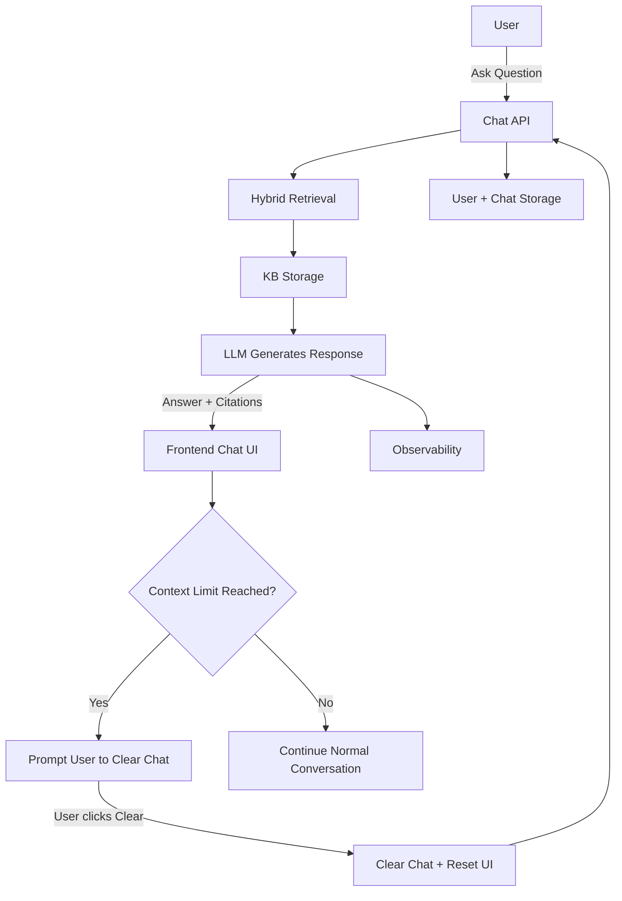

# AI-Powered RAG Knowledgebase — V1 PRD

## 1. Purpose / Problem Statement
Engineers preparing for job switches face friction in:
- Studying core subjects efficiently
- Accessing relevant resources
- Practicing interview-style questions

**Solution:** An AI-powered study partner that answers questions, reinforces concepts, and guides learning using a curated knowledgebase (KB).

---

## 2. Target Users
- Engineers preparing for interviews
- Multi-user system (Google login)
- Each user maintains **one continuous chat history**

---

## 3. Knowledgebase
- Single curated KB (~45 documents)
- Shared across all users
- Users **cannot upload documents**
- **Document ingestion:** Manual script run by the lead
- Serves as **primary source of truth**
- LLM fills gaps from its own knowledge when KB is shallow

---

## 4. Core User Flow

1. User asks a question  
2. Hybrid retrieval from KB (keyword + semantic search)  
3. Check retrieval confidence  
4. If relevant content found:
    - Generate answer
    - Include citations to KB
    - Suggest clarifying follow-up questions  
5. Else:
    - Respond: "Sorry, this is beyond my current scope"

---

## 5. Adaptive Response Structure

| Question Type               | Response Style                                                                 | Example                                                                                   |
|-----------------------------|-------------------------------------------------------------------------------|-------------------------------------------------------------------------------------------|
| Concept question            | Only concept (2–4 sentences)                                                  | “CAP theorem states that a distributed system cannot simultaneously guarantee Consistency, Availability, and Partition tolerance.” |
| Specific aspect question    | Only that aspect                                                              | “Trade-offs: Systems must choose between consistency and availability during network partitions.” |
| Deeper reasoning / follow-up| Structured explanation: Concept → Principle → Trade-offs → Edge Cases → Examples → Suggested follow-ups | Full structured explanation with clarifying follow-ups reinforcing understanding |
| System design question      | Architecture-focused explanation: Requirements → High-level Design → Components → Trade-offs → Examples | URL shortener / rate limiter design example |

---

## 6. Follow-up Questions
- Only **clarifying questions** about the current response
- **Not advanced topics**
- Designed to reinforce first-principles thinking

**Example:**
- Why are network partitions unavoidable?
- What does consistency mean in CAP?
- When would availability be preferred over consistency?

---

## 7. Retrieval & Scope Guard
- **Hybrid search:** Keyword + semantic (vector) search
- KB defines topic boundary
- Only answer if relevant content is present in KB
- LLM fills gaps from its own knowledge when KB is shallow
- If no relevant content → “Sorry, this is beyond my current scope”

---

## 8. Transparency
- Provide **citations to KB documents** used for the answer

**Example:**
- Sources:
  - Distributed Systems Notes
  - CAP Theorem Document

---

## 9. Chat / Conversation Behavior
- Single continuous chat per user
- Follow-up questions supported using **recent chat history**
- **Limit response context** to avoid long prompts / freezing
- Adaptive response length: 2–4 sentences for simple questions
- Specific aspect questions return **only that aspect**
- **Context Limit + Clear Chat:**
  - When a chat exceeds a predefined message or token limit (e.g., 20 messages / 2000 tokens):
    1. Notify the user:
       > "You’ve reached the conversation limit. Clear your chat to continue."
       [Clear Chat] button
    2. On "Clear Chat" button click:
       - Delete the user’s current chat history
       - Clear the chat window
    3. Optional: Store cleared chat traces for analytics (identify knowledge gaps)

---

## 10. Data Storage
- **KB Storage:** Documents and embeddings stored for hybrid search (keyword + semantic)
- **User Storage:** User accounts and authentication metadata
- **Chat Storage:** Recent conversation history per user for context
- **Observability:** All prompts and responses logged for tracing and analytics

---

## 11. Scope / Out-of-Scope (V1)
**Out-of-Scope for V1:**
- Multiple chat sessions per user
- User document uploads
- Fine-grained chunking or auto chunking
- Continuous conversation across multiple unrelated concepts
- Auto-generating advanced topic follow-ups
- Complex analytics beyond tracing

---

## 12. User Feedback

Users can rate each AI response with a thumbs up or thumbs down.

- "Was this answer helpful?" label with 👍 / 👎 buttons appears below every AI message
- Only the **latest AI response** has active buttons — previous messages are locked
- Clicking the same thumb again **deselects** (removes feedback)
- Clicking the opposite thumb **switches** the rating
- Feedback is optional — users can ignore the buttons and keep chatting
- Feedback is stored per message (one-to-one) and per user (one-to-many)
- Feedback events are traced to Phoenix for analytics

---

## 13. Summary
V1 provides a **shippable study partner** that:
- Answers concept and system design questions based on KB
- LLM fills gaps from its own knowledge when KB is shallow
- Produces adaptive, user-intent-focused explanations
- Suggests simple follow-ups to reinforce understanding
- Shows citations to KB
- Maintains single chat per user with context
- Limits response context and length
- Supports **context clearing** when limits are reached

## 14. System Flow Diagram

