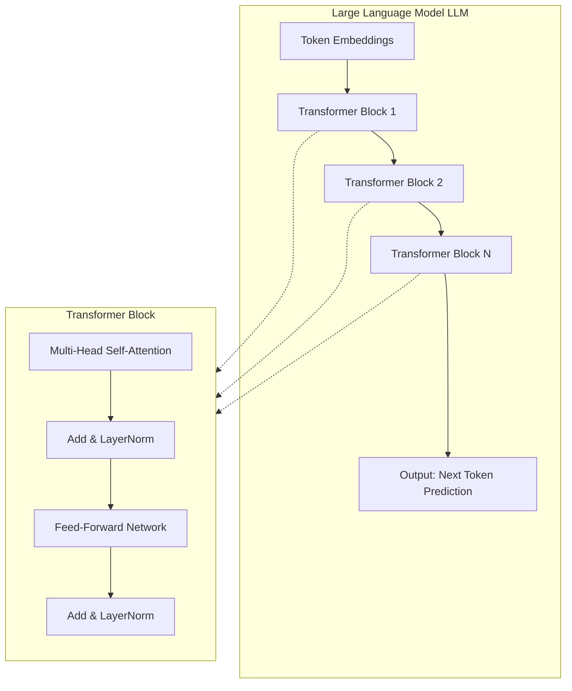

# LLM Architecture (High-Level)

## Overview

A Large Language Model (LLM) takes tokenized text as input and predicts the next token as output.

The input tokens are first converted into **token embeddings** — dense vector representations. These pass through a series of **stacked transformer blocks**, each refining the representation by capturing relationships between tokens. The final output of the last transformer block is used to predict the next token.

Each **transformer block** internally consists of:
- **Multi-Head Self-Attention** — allows each token to attend to all other tokens in the sequence
- **Add & LayerNorm** — residual connection followed by layer normalisation for stable training
- **Feed-Forward Network** — applies a non-linear transformation to each token's representation independently
- **Add & LayerNorm** — another residual connection and normalisation

The depth of the model (number of stacked transformer blocks) determines how much context and abstraction the model can capture.

