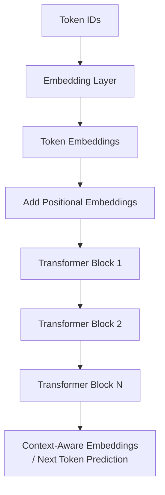
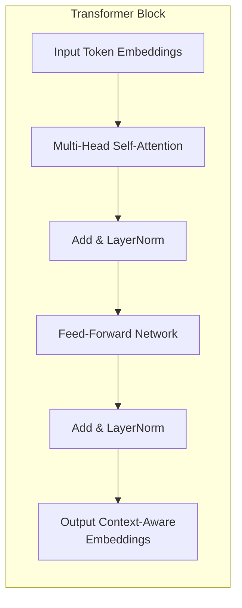

# Transformers in LLMs

**Concept:** Large language models (LLMs) use transformers under the hood to process tokenized text and generate context-aware outputs.

---

## Input Processing

### 1️⃣ Tokenization
- Input sentence → split into **tokens**
- A word can be split into multiple tokens depending on vocabulary
- Helps handle rare words and reduces vocabulary size

### 2️⃣ Embeddings
- Tokens are converted into **vector embeddings** via the embedding layer
- **Initial embeddings are not context-aware**
- Context-aware representations are formed **after attention layers** in the transformer

---

## Transformer Block Internals

### 3️⃣ Transformer Blocks
- LLMs have **stacked transformer blocks**
- Each block contains:
  - **Multi-head self-attention**
  - **Feed-forward network**
  - **Residual connections + LayerNorm**

### 4️⃣ Attention Heads (Q/K/V)
- Each token generates:
  - **Query (Q):** What I am looking for?
  - **Key (K):** What I contain?
  - **Value (V):** What information I carry?
- Each token computes relevance with all other tokens
- Weighted sum of values produces a **context-aware vector**

### 5️⃣ Feed-Forward Layer
- Attention outputs go through **feed-forward network**
- Produces updated **context-aware vectors** for each token

---

## Token Generation and Key Notes

### 6️⃣ Decoding / Token Generation
- In **decoder-only models (GPT style)**:
  - Transformer stack **predicts next token** based on previous tokens
  - Uses **masked self-attention** to prevent seeing future tokens

### 7️⃣ Key Notes
- Multi-head attention captures different relationships (syntax, semantics)
- Positional encoding adds **order information**
- LLM embeddings are **dynamic during generation**
- Encoder-only embeddings (like SentenceTransformers) are **static after creation**, but still context-aware within the sentence

## Transformer Architecture

### Data Flow

### Internals of Transformer Block

