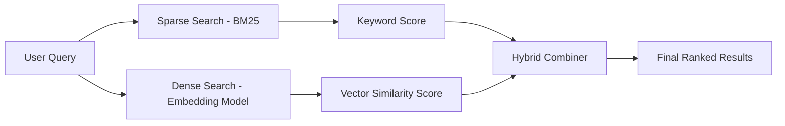

# Sparse vs Dense vs Hybrid Search

## Sparse Search (Keyword Search)

Keyword search is also referred to as **Sparse Search**.

In keyword search, exact keywords from the query are searched in the available text documents. If a keyword is found, its frequency increases. If it is not found, its value remains 0.

The internal representation of documents in sparse search consists mostly of zeros because only a small subset of all possible words appear in a given document. Since most dimensions are zero, it is called **sparse**.

For keyword search, we commonly use the **BM25 (Best Matching 25)** algorithm.  
It is based on an **inverted index** of the input text.

The vector database creates and maintains the inverted index. If for some reason the inverted index is not created or updated properly, BM25 may return an empty list.

Sparse search is based on exact keyword match and term frequency scoring.

---

## Dense Search (Semantic Search)

Dense search is also referred to as **semantic search**.

Semantic search finds matching documents based on the **meaning** of the text rather than exact keyword match.

It works as follows:

- Text is converted into vector embeddings using an embedding model.
- The query is also converted into a vector embedding.
- The similarity between the query vector and stored document vectors is computed.
- Documents with the most similar vectors are returned.

Unlike sparse representations, dense embeddings contain real values across most dimensions (very few zeros), which is why it is called **dense**.

Dense search captures semantic similarity even when exact keywords do not match.

---

## Hybrid Search

Hybrid search combines both sparse search and dense search.

It uses:

- Keyword-based scoring (BM25)
- Semantic similarity scoring (vector search)

The results from both approaches are combined into a single ranking score.

Hybrid search is useful because neither sparse nor dense search is perfect on its own.

Examples:

- For long-form content or conceptual queries → semantic search often performs better.
- For exact identifiers (e.g., product serial numbers, IDs) → keyword search performs better.

Hybrid search allows tuning using a parameter such as **alpha**.

### Alpha Interpretation

| Alpha Value | Meaning |
|-------------|----------|
| 0 | Pure keyword (sparse) search |
| 1 | Pure semantic (dense) search |
| Closer to 0 | Keyword prioritized |
| Closer to 1 | Semantic prioritized |

Hybrid search balances lexical precision with semantic understanding.

---

## First Principles View

- Sparse search relies on exact token overlap and term frequency.
- Dense search relies on vector similarity in embedding space.
- Hybrid search combines lexical and semantic signals to improve retrieval robustness.

