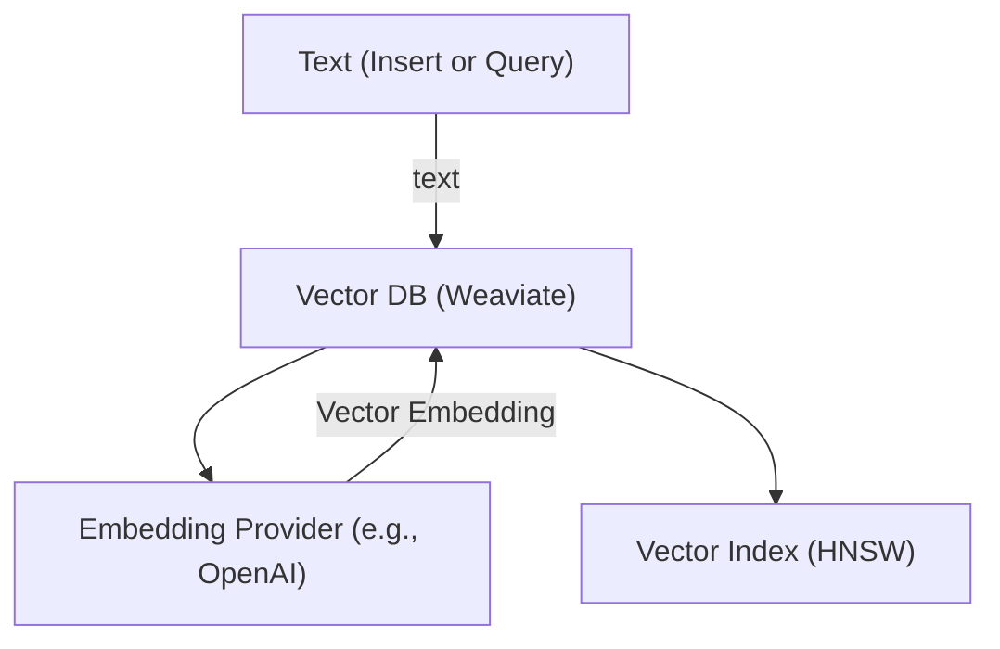
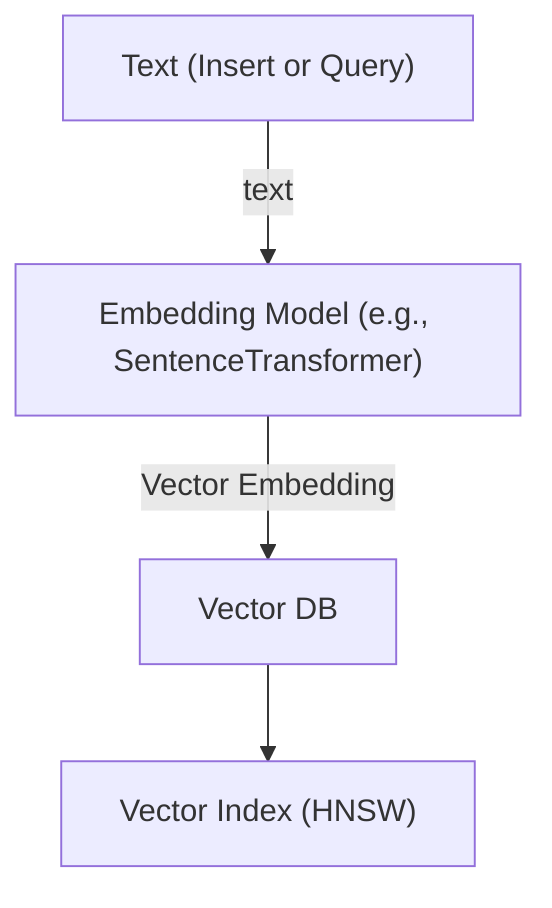

# Vectorizer vs Manual Embeddings

## Vectorizer

Vectorizer is a module present inside the vector database.  
For example, Weaviate vector DB has modules like `text2vec-openai` and others.

When a vectorizer is specified in the schema:

```json
"vectorizer": "text2vec-openai"
```

The vector DB automatically calls the embedding model corresponding to that vectorizer.

For example:

- `text2vec-openai` calls the OpenAI embedding model endpoint.
- The input text is converted into vector embeddings.
- The vector database then stores and indexes those vector embeddings.

### Flow



Vector embeddings are required for any vector-based (semantic) search.  
They are **not required** for pure keyword search (BM25).

Use:

`with_near_text()`

---

## Manual Embeddings

When vectorizer is set to:

```json
"vectorizer": "none"
```

The vector database does **not** generate embeddings.

The application is responsible for generating embeddings and providing them to the database.

For example:

- Send text input to an embedding model (e.g., SentenceTransformer).
- Generate the vector embedding in the application.
- While inserting text data into the database, also insert the generated embedding.

In this setup, the vector database does not call any external embedding model.

### Flow



Use:

`with_near_vector()`

---

## First Principles View

- A vector database is responsible for **storing and indexing vectors**.
- An embedding model is responsible for **converting text into vectors**.
- A vectorizer module connects the vector database to an embedding model automatically.
- In manual embeddings, this responsibility is handled by the application instead of the database.
- After embeddings are stored in the vector database, a vector index (such as HNSW) is used to efficiently retrieve the nearest vectors during search. The index enables fast approximate nearest neighbor search instead of comparing against every stored vector.

