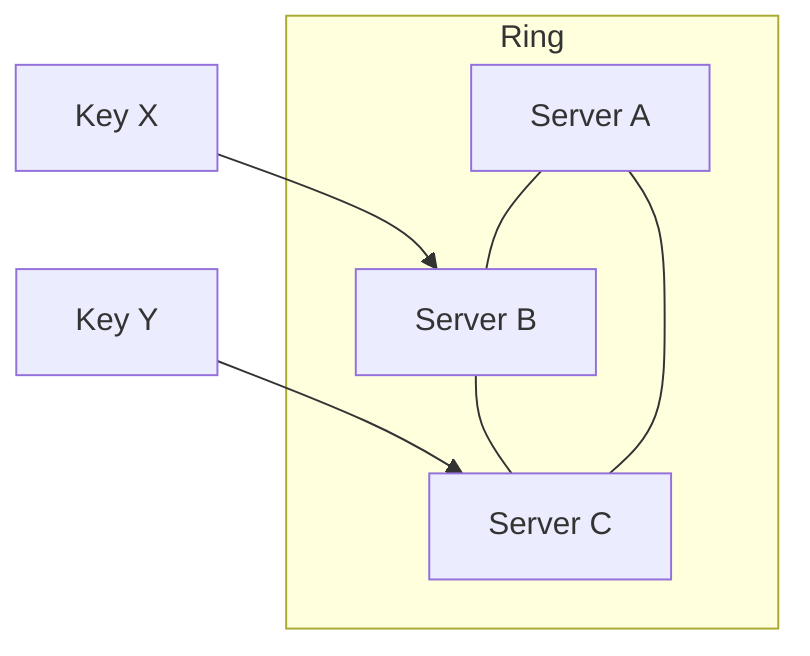

# Consistent Hashing

## 1. Basic Modulo-based Hashing

### Concept

Consistent hashing is a technique used to **uniformly distribute requests across multiple servers**.
It is widely used in **load balancers, distributed caches, and sharded databases**.

- Each request (e.g., client IP) is hashed using:

    server_index = hash(request_key) % N

- `N` = total number of servers  
- Request is routed to `server_index`

**Limitation:**  
- When a server crashes or is added/removed:
  - Many keys are remapped → cache misses increase
  - Request distribution is disrupted

---

## 2. Circular / Ring-based Consistent Hashing

- Both **servers and requests** are mapped to a **hash ring** (continuous hash space, e.g., 0–2³²)  
- Each request’s hash determines its **position on the ring**  
- The **first server clockwise from that position** handles the request  
- If a server goes down, only keys mapped to that server are reassigned → **minimal remapping**

**Key Distinction from Modulo Hashing:**  
- Circular hashing **uses a hash function** but **does not use `% N`**  
- The number of servers does not directly divide the hash space  
- Only a **small fraction of keys** are affected when servers are added/removed

**Optional: Virtual Nodes**  
- Each physical server can be represented by **multiple points on the ring**  
- Improves **load balance**, especially if servers have different capacities

---

## Advantages, Usage, and Takeaways

### Advantages

- Stable request distribution → only a small portion of requests are remapped on server changes
- Improves cache utilization
- Scales well when servers are **added or removed**

### Real-world Usage

- Distributed caching systems (e.g., Memcached, DynamoDB)
- Sharded databases
- Load balancers for large-scale applications

### Key Takeaways

- Avoids massive remapping of requests
- Works well with dynamic server pools
- Virtual nodes improve load balance further

## Consistent Hashing Diagram

### Explanation

- **A, B, C** → servers placed around a ring  
- **Key X → B** → first server clockwise from hash position of X  
- **Key Y → C** → first server clockwise from hash position of Y  
- The `---` links simulate the circular ring  

---