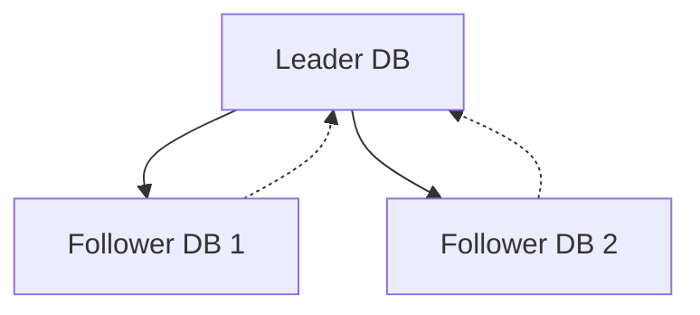

# SQL vs NoSQL

## SQL (Relational Databases)

- **SQL** = Structured Query Language  
- Used to access **RDBMS (Relational Database Management Systems)**  
- RDBMS follows **ACID** principles  

### ACID Principles

1. **Atomicity** – All-or-nothing transactions. Partial writes are not allowed.  
2. **Consistency** – Ensures constraints like primary key, foreign key, and non-null are always respected.  
3. **Isolation** – Concurrent transactions do not interfere; executed in sequence to avoid side effects.  
4. **Durability** – Data is persisted to disk, surviving crashes or failures.  

### Limitations

- Harder to **scale horizontally** due to ACID; typically scaled vertically (more CPU/RAM).  
- Disk storage and constraints increase **latency**.  
- Expensive to maintain under heavy concurrent load.  

### Use Cases

- Banking transactions, accounting systems, and applications requiring **strong consistency and reliability**.  

---

## NoSQL (Non-relational Databases)

- Types: **Key-Value**, **Wide Column**, **Document-based**, **Graph**  
- Easy to **scale horizontally** across multiple servers  
- Does **not follow ACID** strictly; instead uses **BASE (Basically Available, Soft state, Eventual consistency)**  

### Characteristics

- Can have **leader and replicas (followers)**  
- Writes happen on **leader**, then replicated asynchronously to followers  
- Temporary inconsistencies or **stale reads** are possible  

### Use Cases

- Systems requiring **high availability and horizontal scalability**  
- Examples: caching layers, social media feeds, analytics platforms  

---

## Key Differences

| Feature           | SQL (RDBMS)                  | NoSQL                         |
|------------------|------------------------------|-------------------------------|
| Consistency       | Strong (ACID)               | Eventual (BASE)               |
| Scaling           | Vertical                     | Horizontal                    |
| Schema            | Fixed / Structured           | Flexible / Schema-less        |
| Storage           | Disk-based                   | Memory or disk-based          |
| Use Case          | Transactions, Accounting     | High-volume, flexible systems |

---

## Notes

- Some NoSQL databases (e.g., MongoDB) **support ACID for limited operations**, usually single-document writes.  
- BASE explained:  
  - **Basically Available** → system responds even under partial failure  
  - **Soft state** → system state may change over time  
  - **Eventual consistency** → data will converge eventually  

Arrows show **write propagation** from leader to followers. Dashed lines indicate **read consistency or replication acknowledgement**.
